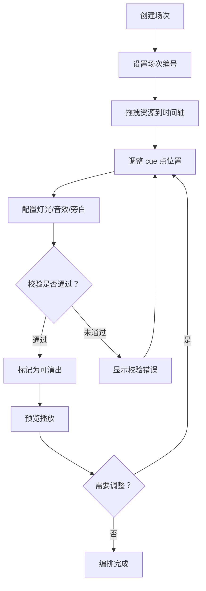

## 1. 产品概述

皮影戏舞台调度台是一款面向皮影戏表演团体的专业排练辅助工具，用于编排皮影戏演出中的角色出场、幕后灯光、旁白、锣鼓点和幕景切换。通过可视化的时间轴操作，让导演和演员能够直观地设计和预演整场演出的舞台调度。

**核心价值**：将传统皮影戏排练数字化，提供精确的时间轴控制和多维度的舞台元素管理，大幅提升排练效率和演出质量。

---

## 2. 核心功能

### 2.1 用户角色

| 角色 | 注册方式 | 核心权限 |
|------|----------|----------|
| 导演/编排者 | 无需注册，本地使用 | 创建/编辑场次、调度角色、设置灯光音效、预览播放、导出编排方案 |

### 2.2 功能模块

1. **主调度台页面**：三栏布局（左：资源面板，中：时间轴，右：参数面板），场次管理，校验状态，预览播放控制
2. **资源管理面板**：皮影角色库、幕景库管理，支持拖拽添加到时间轴
3. **时间轴组件**：多轨道时间轴可视化，cue 点拖拽调整，时间标尺，缩放控制
4. **参数配置面板**：灯光亮度调节、音效配置、旁白文本编辑、角色幕位设置
5. **场次管理模块**：场次编号、可演出状态标记、完整性校验
6. **预览播放模块**：实时预览播放，播放顺序即时更新

### 2.3 页面详情

| 页面名称 | 模块名称 | 功能描述 |
|----------|----------|----------|
| 主调度台 | 顶部工具栏 | 场次创建/切换、保存、导入/导出、播放控制、校验状态显示 |
| 主调度台 | 左侧资源面板 | 皮影角色列表（可拖拽）、幕景列表（可拖拽）、资源搜索与筛选 |
| 主调度台 | 中间时间轴 | 时间标尺、多轨道显示（角色/灯光/音效/旁白/幕景）、cue 点可视化、拖拽调整时间点、轨道缩放 |
| 主调度台 | 右侧参数面板 | 选中 cue 点的详细参数配置、灯光亮度滑块（0-100）、音效选择与音量、旁白文本、角色幕位设置 |
| 主调度台 | 场次列表 | 场次编号管理、可演出状态标记、完整性校验结果提示 |

---

## 3. 核心流程

### 3.1 场次编排流程
导演创建新场次 → 设置场次编号（必须唯一）→ 从左侧资源面板拖拽角色/幕景到时间轴 → 在时间轴上调整 cue 点时间位置 → 在右侧面板配置灯光、音效、旁白参数 → 系统自动校验完整性 → 标记为"可演出"状态

### 3.2 预览播放流程
选择场次 → 点击播放按钮 → 播放头沿时间轴移动 → 到达 cue 点时触发对应效果（灯光变化/音效播放/旁白提示/幕景切换）→ 拖拽调整 cue 点后播放顺序立即更新

### 3.3 业务规则校验流程
编辑任意参数 → 实时触发校验引擎 → 检查场次编号唯一性、角色时间冲突、cue 点时间递增、灯光亮度范围、场次完整性 → 显示校验结果提示

---

## 4. 业务规则

| 规则编号 | 规则描述 | 校验时机 | 违反后果 |
|----------|----------|----------|----------|
| R1 | 场次编号必须唯一 | 创建/编辑场次编号时 | 阻止保存，提示编号冲突 |
| R2 | 同一皮影角色不能在同一时刻出现在两个幕位 | 拖拽角色到时间轴 / 调整 cue 点时间时 | 高亮冲突的角色，提示时间冲突 |
| R3 | 时间轴上的 cue 点必须按时间递增排列 | 调整 cue 点时间时 | 自动排序，或阻止移动到非递增位置 |
| R4 | 灯光亮度范围为 0-100 | 设置灯光亮度时 | 限制输入范围，超出自动截断 |
| R5 | 缺少音效或幕景的场次不能标记为可演出 | 标记可演出状态时 | 阻止标记，提示缺少必要元素 |
| R6 | 拖动 cue 点后预览播放顺序必须立即更新 | 拖拽 cue 点完成时 | 实时重算播放序列 |

---

## 5. 用户界面设计

### 5.1 设计风格
- **主色调**：深红/朱砂色系（#C0392B）呼应皮影戏传统色彩，辅以暖金色（#D4A574）点缀
- **背景色**：深灰近黑（#1A1A2E）模拟幕后舞台氛围，营造沉浸感
- **辅助色**：暖白（#F5F0EB）用于文字和卡片，琥珀色（#E67E22）用于警示状态
- **按钮风格**：圆角微凸起按钮，主要操作使用朱砂色填充，次要操作使用描边风格
- **字体**：标题使用衬线体风格，正文使用无衬线体，尺寸层级：24px / 16px / 14px / 12px
- **布局风格**：三栏布局，中间时间轴占主要空间，左右面板可折叠收起
- **图标风格**：线性图标，笔画2px，与整体暗色主题统一

### 5.2 页面设计概览

| 页面名称 | 模块名称 | UI 元素 |
|----------|----------|---------|
| 主调度台 | 顶部工具栏 | 暗色背景工具栏，场次下拉选择器，播放/暂停/重置按钮组，校验状态指示灯，保存/导出按钮 |
| 主调度台 | 左侧资源面板 | 搜索输入框，角色卡片网格（带角色图标和名称），幕景缩略图列表，拖拽手柄视觉提示 |
| 主调度台 | 中间时间轴 | 水平时间标尺（带刻度），5 条轨道（角色/灯光/音效/旁白/幕景），cue 点标记（可拖拽圆形/菱形），红色播放头线，缩放滑块 |
| 主调度台 | 右侧参数面板 | 灯光亮度滑块（0-100），音效文件选择器+音量滑块，旁白文本编辑区，角色幕位选择下拉，删除 cue 点按钮 |
| 主调度台 | 底部场次栏 | 场次编号标签，可演出状态徽章，场次切换按钮，新增场次按钮 |

### 5.3 响应式策略
- 桌面优先设计，最小支持 1280px 宽度
- 1280px-1440px：左右面板可折叠，时间轴自适应
- 1440px+：三栏完整展示，时间轴宽度充裕
- 触摸优化：cue 点拖拽热区不小于 44px

### 5.4 动效设计
- cue 点拖拽时：跟随鼠标平滑移动，释放时吸附到最近时间刻度
- 播放头：匀速移动，带微弱红色辉光脉冲效果
- 资源拖入时间轴：出现虚线占位框，释放后填充色彩
- 场次切换：时间轴内容淡入淡出过渡（300ms）
- 校验错误：cue 点边框闪烁红色提示

