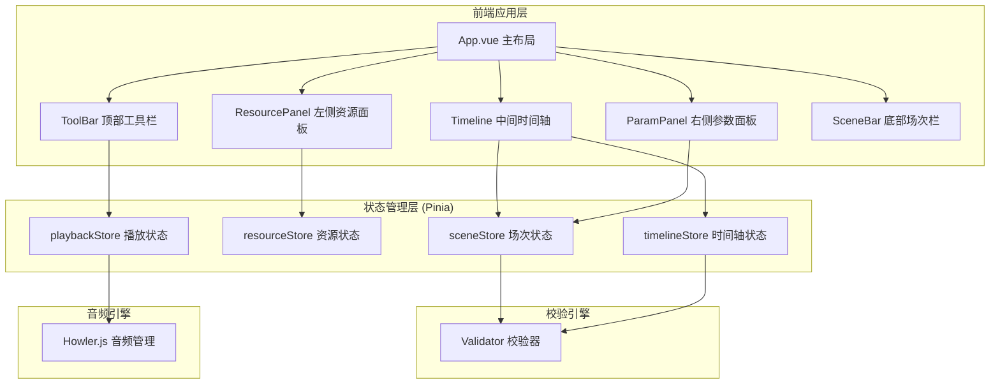
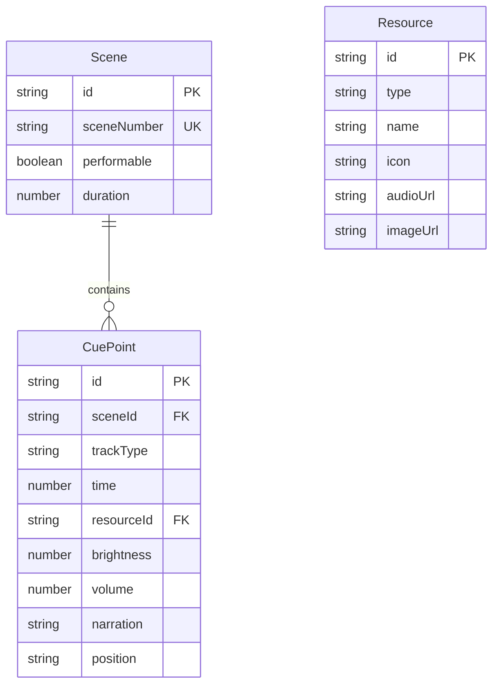

## 1. 架构设计



## 2. 技术说明

- **前端框架**：Vue 3 + TypeScript + Vite 5
- **UI 组件库**：Naive UI（暗色主题定制）
- **状态管理**：Pinia
- **音频引擎**：Howler.js
- **日期/时间工具**：date-fns
- **初始化工具**：vite-init
- **后端**：无（纯前端，数据本地持久化）
- **数据持久化**：localStorage

## 3. 路由定义

| 路由 | 用途 |
|------|------|
| / | 主调度台页面（单页应用，无路由切换） |

## 4. 数据模型

### 4.1 数据模型定义



### 4.2 数据定义语言

#### Scene（场次）

| 字段 | 类型 | 必填 | 说明 |
|------|------|------|------|
| id | string | 是 | UUID 主键 |
| sceneNumber | string | 是 | 场次编号（唯一） |
| performable | boolean | 是 | 是否可演出 |
| duration | number | 是 | 场次时长（秒） |
| cues | CuePoint[] | 是 | 包含的 cue 点列表 |

#### CuePoint（触发点）

| 字段 | 类型 | 必填 | 说明 |
|------|------|------|------|
| id | string | 是 | UUID 主键 |
| sceneId | string | 是 | 所属场次 ID |
| trackType | enum | 是 | 轨道类型：character / lighting / sound / narration / backdrop |
| time | number | 是 | 触发时间（秒） |
| resourceId | string | 否 | 关联资源 ID |
| brightness | number | 否 | 灯光亮度 0-100（仅 lighting 轨道） |
| volume | number | 否 | 音量 0-100（仅 sound 轨道） |
| narration | string | 否 | 旁白文本（仅 narration 轨道） |
| position | string | 否 | 幕位标识（仅 character 轨道） |

#### Resource（资源）

| 字段 | 类型 | 必填 | 说明 |
|------|------|------|------|
| id | string | 是 | UUID 主键 |
| type | enum | 是 | 资源类型：character / backdrop / sound |
| name | string | 是 | 资源名称 |
| icon | string | 否 | 图标标识 |
| audioUrl | string | 否 | 音频文件 URL |
| imageUrl | string | 否 | 图片 URL |

## 5. Store 架构

### 5.1 sceneStore
- 场次列表管理（CRUD）
- 场次编号唯一性校验（R1）
- 可演出状态管理（R5）
- 当前选中场次

### 5.2 resourceStore
- 角色资源库
- 幕景资源库
- 音效资源库
- 资源搜索筛选

### 5.3 timelineStore
- 当前场次的 cue 点管理
- cue 点拖拽与时间更新
- cue 点时间递增校验（R3）
- 角色冲突检测（R2）
- 选中 cue 点状态
- 播放顺序计算（R6）

### 5.4 playbackStore
- 播放/暂停/重置控制
- 当前播放时间
- 播放头位置
- Howler.js 音频实例管理
- 预览播放序列

## 6. 组件结构

```
src/
├── App.vue                    # 主布局（三栏 + 顶部工具栏 + 底部场次栏）
├── main.ts                    # 入口文件
├── types/
│   └── index.ts               # TypeScript 类型定义
├── stores/
│   ├── scene.ts               # 场次 Store
│   ├── resource.ts            # 资源 Store
│   ├── timeline.ts            # 时间轴 Store
│   └── playback.ts            # 播放 Store
├── composables/
│   ├── useDragCue.ts          # cue 点拖拽逻辑
│   ├── useAudioPlayer.ts      # Howler.js 音频播放
│   └── useValidator.ts        # 校验引擎
├── components/
│   ├── ToolBar.vue            # 顶部工具栏
│   ├── ResourcePanel.vue      # 左侧资源面板
│   ├── Timeline.vue           # 中间时间轴
│   ├── TimelineTrack.vue      # 时间轴单条轨道
│   ├── CuePoint.vue           # 时间轴 cue 点
│   ├── TimeRuler.vue          # 时间标尺
│   ├── ParamPanel.vue         # 右侧参数面板
│   ├── LightConfig.vue        # 灯光配置组件
│   ├── SoundConfig.vue        # 音效配置组件
│   ├── NarrationConfig.vue    # 旁白配置组件
│   ├── CharacterConfig.vue    # 角色幕位配置组件
│   ├── SceneBar.vue           # 底部场次栏
│   └── ValidationBadge.vue    # 校验状态徽章
└── styles/
    └── global.css             # 全局样式
```
